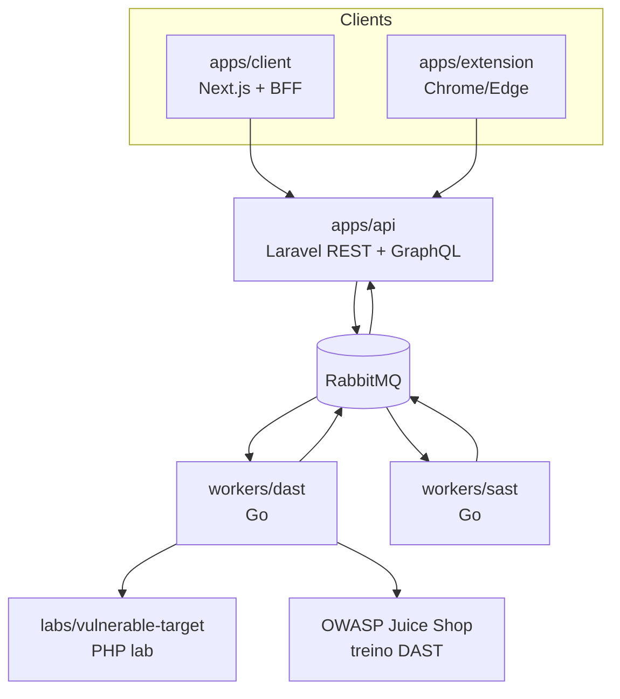

# Architecture

Visão da arquitetura do monorepo Shingeki. Voltar ao [início](index.md).

Como subir a stack: [RUN-PROJECT.md](RUN-PROJECT.md). Contratos HTTP: [API.md](API.md).

## Visão geral

O browser fala só com o BFF (`apps/client/app/api/*`). O token Sanctum fica em cookie http-only; o BFF encaminha Bearer para a Laravel. GraphQL (`POST /graphql`) entra pelo BFF em `/api/graphql` e hoje cobre só a sidebar.

| Pacote | Documento |
|--------|-----------|
| `apps/api` | [architecture/shingeki-api.md](architecture/shingeki-api.md) |
| `apps/client` | [architecture/shingeki-client.md](architecture/shingeki-client.md) |
| `apps/extension` | Contrato: [TARGET-SESSION](api/TARGET-SESSION.md). Empacotamento: [README da extensão](https://github.com/AllanCordova/shingeki/blob/main/apps/extension/README.md). |
| `workers/dast` | [architecture/shingeki-dast-worker.md](architecture/shingeki-dast-worker.md) |
| `workers/sast` | [architecture/shingeki-sast-worker.md](architecture/shingeki-sast-worker.md) |
| `labs/vulnerable-target` | [architecture/shingeki-vulnerable-target.md](architecture/shingeki-vulnerable-target.md) |
| Juice Shop (treino) | [architecture/shingeki-juice-shop.md](architecture/shingeki-juice-shop.md) |

## Fluxo de um disparo DAST

1. O client chama `POST .../attacks/dispatch` com aceite (`accepted_responsibility`, `accepted_legal_terms`, `terms_version`).
2. A API valida policy e o aceite, grava `attack_acknowledgments` e enfileira o lote em `attacks.dispatch`.
3. O worker descobre superfície, executa payloads, publica **probes** (`attack.probe`) e **achados** (`attack.result`) em `attacks.results`, e fecha com `attack.dispatch.completed`.
4. O comando `attacks:consume-results` persiste probes/`SystemResult` e marca o dispatch como concluído.
5. O client consulta `system-results` (polling enquanto o dispatch está pendente).

Quem publica/consome em Docker: [RUN-PROJECT.md](RUN-PROJECT.md#fluxo-de-um-disparo-dast). Filas e payloads: [architecture/shingeki-dast-worker.md](architecture/shingeki-dast-worker.md). HTTP: [api/ATTACKS-AND-RESULTS.md](api/ATTACKS-AND-RESULTS.md).
