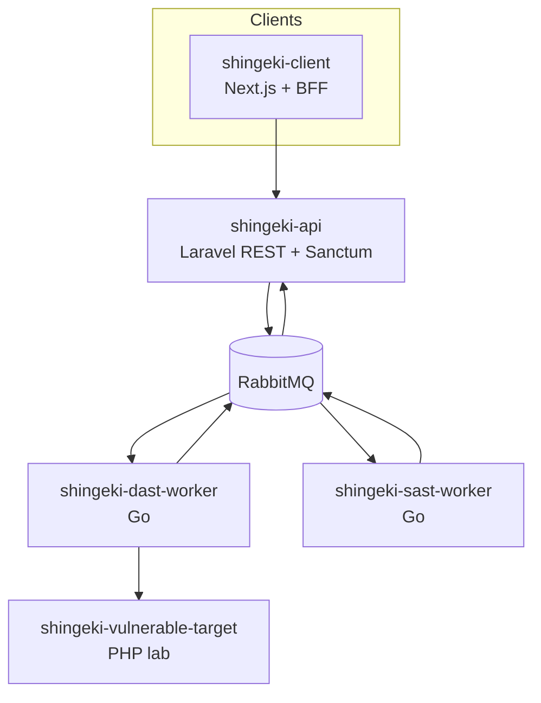

# Architecture

Visão da arquitetura do monorepo Shingeki. Voltar ao [início](index.md).

## Visão geral

| Pacote | Documento |
|--------|-----------|
| `shingeki-api` | [architecture/shingeki-api.md](architecture/shingeki-api.md) |
| `shingeki-client` | [architecture/shingeki-client.md](architecture/shingeki-client.md) |
| `shingeki-dast-worker` | [architecture/shingeki-dast-worker.md](architecture/shingeki-dast-worker.md) |
| `shingeki-sast-worker` | [architecture/shingeki-sast-worker.md](architecture/shingeki-sast-worker.md) |
| `shingeki-vulnerable-target` | [architecture/shingeki-vulnerable-target.md](architecture/shingeki-vulnerable-target.md) |

## Fluxo de um disparo DAST

1. O client web chama `POST .../attacks/dispatch` com aceite de responsabilidade (`accepted_responsibility`, `accepted_legal_terms`, `terms_version`).
2. A API valida policy e o aceite, grava `attack_acknowledgments` e enfileira o lote em `attacks.dispatch`.
3. O worker consome o lote, descobre superfície no alvo, executa payloads e publica achados em `attacks.results`.
4. O comando `attacks:consume-results` na API persiste resultados e fecha o dispatch.
5. O client consulta `system-results` (com polling para dispatches pendentes).

Contratos HTTP: [API.md](API.md). Filas e payloads do worker: [architecture/shingeki-dast-worker.md](architecture/shingeki-dast-worker.md).
