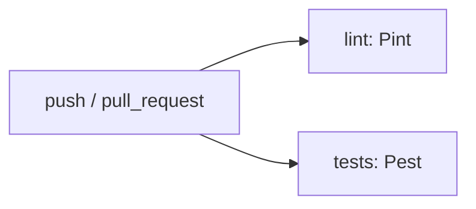

# Integração contínua (CI)

Pipeline definido em [`.github/workflows/ci.yml`](../.github/workflows/ci.yml). Dispara em **push** e **pull_request** para qualquer branch.

Hoje o workflow cobre apenas **`shingeki-api`**. O client tem lint local (ESLint), mas ainda não entra no GitHub Actions.

## Jobs no GitHub Actions

| Job | Nome | O que faz |
|-----|------|-----------|
| `lint` | Lint (Pint) | Instala dependências Composer, corrige estilo com Pint e em seguida verifica com `--test` |
| `tests` | Tests (Pest) | Copia `.env.example`, gera `APP_KEY` e executa `composer test` (Pest via `php artisan test`) |

Ambos usam **PHP 8.4** em `ubuntu-latest`. O diretório de trabalho padrão do workflow é `shingeki-api`.

### Fluxo resumido



## Rodar localmente (API)

Na pasta `shingeki-api`, com `composer install` já executado:

### Lint — corrigir e verificar (igual ao CI)

```bash
cd shingeki-api
composer lint
```

Roda `pint` (corrige) e depois `pint --test` (garante que não sobrou nada).

Equivalente a:

```bash
./vendor/bin/pint
./vendor/bin/pint --test
```

### Lint — só corrigir

```bash
cd shingeki-api
composer lint:fix
```

Equivalente a `./vendor/bin/pint`.

### Testes (igual ao CI)

```bash
cd shingeki-api
composer test
```

Equivalente a `php artisan test` (suite Pest). Usa SQLite em memória nos testes; não exige Docker.

### Tudo antes de abrir PR (API)

```bash
cd shingeki-api
composer lint
composer test
```

## Rodar localmente (client)

O client **não** está no workflow atual; rode antes de enviar alterações em `shingeki-client`:

### Lint (ESLint)

```bash
cd shingeki-client
npm install
npm run lint
```

### Build de produção

```bash
cd shingeki-client
npm run build
```

## Referência rápida

| Pacote | Ferramenta | Verificar | Corrigir |
|--------|-----------|-----------|----------|
| `shingeki-api` | [Laravel Pint](https://laravel.com/docs/pint) | `composer lint` | `composer lint:fix` |
| `shingeki-api` | [Pest](https://pestphp.com/) | `composer test` | — |
| `shingeki-client` | ESLint (Next.js) | `npm run lint` | `npx eslint --fix .` |

## Cache no CI

O workflow cacheia `shingeki-api/vendor` pela chave `composer-{PHP_VERSION}-{hash do composer.lock}` para acelerar `composer install` entre execuções.

## Ampliar o pipeline (futuro)

Candidatos naturais para novos jobs no mesmo `ci.yml`:

- `npm run lint` e `npm run build` em `shingeki-client`
- `go test` / `golangci-lint` em `shingeki-dast-worker`
