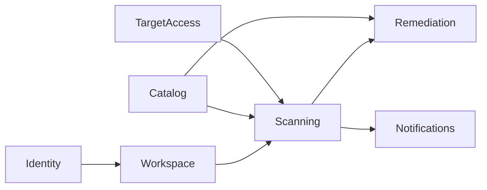

# shingeki-api

Backend Laravel 13 — API REST com prefixo `/api`, autenticação Sanctum e autorização por policies.

As pastas Laravel permanecem (`Http/Controllers`, `Models`, `Services`, …). Cada uma espelha os mesmos **domínios**. URLs, nomes de rotas, tabelas, payloads JSON, comandos e filas não mudam com o namespace.

## Domínios



| Módulo | Responsabilidade | Exemplos |
|--------|------------------|----------|
| **Identity** | Usuário, auth, capas, papéis | `Models/Identity/User`, `Http/Middleware/Identity/EnsureUserRole` |
| **Workspace** | Projetos, sistemas, navegação, dashboard | `Models/Workspace/Project`, `Services/Workspace/ProjectDashboardService` |
| **Catalog** | Ataques, stacks, remediações, import CSV | `Models/Catalog/Attack`, `Console/Commands/Catalog/ConsumeCatalogImportsCommand` |
| **TargetAccess** | Assinaturas, sessão do alvo, proxy manual | `Models/TargetAccess/Signature`, `Services/TargetAccess/ManualProxy` |
| **Scanning** | Dispatch, probes, resultados, relatório | `Models/Scanning/AttackDispatch`, `Console/Commands/Scanning/ConsumeAttackResultsCommand` |
| **Remediation** | IA, contexto de código, GitHub | `Models/Remediation/AiRemediationSuggestion`, `Services/Remediation/GitHub` |
| **Notifications** | Notificações in-app | `Models/Notifications/UserNotification` |

Código compartilhado (segurança de URL, redação, filas) fica em `Services/Security` e `Support/Queue`.

## Camadas

```
app/
  Http/Controllers/{Domain}/   # Auth, Project, Attack, Catalog*, …
  Http/Middleware/Identity/    # EnsureUserRole (ADMIN bypass)
  Http/Requests/{Domain}/      # Form Requests + Concerns de paginação/URL
  Http/Resources/{Domain}/     # JSON estável (User, Project, System)
  Policies/{Domain}/           # Escopo por dono; CatalogPolicy (ownership + papéis)
  Models/{Domain}/             # Eloquent; morph aliases estáveis para dispatch/import
  Services/{Domain}/           # Regras de negócio
  Enums/{Domain}/
  Console/Commands/{Domain}/   # attacks:consume-results, catalog:consume-imports
```

Factories continuam em `database/factories` (`Database\Factories\*`). Policies de `Attack` (dispatch) e `SystemResult`/`AttackDispatch` estão registradas explicitamente.

## Autenticação e autorização

- **Sanctum**: token Bearer em rotas protegidas; registro/login em `/api/auth/*`; expiração configurável; teto de tokens `auth-token` ativos.
- **Papéis** (`UserRole`): `USER` (padrão no registro), `SPECIALIST` e `ADMIN` gerenciam catálogo; `SPECIALIST`/`ADMIN` usam proxy manual. Permissões no enum + `CatalogPolicy` + middleware `role:`.
- **Policies**: escopo pelo dono do projeto/sistema (`$system->isOwnedBy($user)`); catálogo com ownership (specialist só edita o próprio; admin edita qualquer).

## Domínio principal

| Área | Responsabilidade |
|------|------------------|
| Projetos / sistemas | CRUD aninhado; capas via multipart (`cover` ou `cover_upload_id`) |
| Biblioteca de capas | `UserCoverLibraryService` — limite por usuário, reuso e remoção com regras de referência |
| Assinaturas | Token em meta tag HTML do alvo; dispatch resolve assinatura ativa (sem body) |
| Sessão do alvo | `SystemTargetSession` — headers criptografados; popup ou import manual para DAST autenticado |
| Catálogo global | CRUD `/api/catalog/*` + import CSV assíncrono (`catalog:consume-imports`) |
| DAST / SAST | `AttackCatalogService` monta lote (ataques de autores ADMIN/SPECIALIST); `AttackQueuePublisher` publica em RabbitMQ |
| Resultados | `AttackResultsMessageHandler` + `AttackResultProcessor` persistem achados; exclusão em batch |
| Remediação | Catálogo de snippets (`RemediationResolver`) e sugestões IA (`AiRemediationService`) |

## Integração assíncrona

- **Saída**: filas `attacks.dispatch` e `attacks.sast.dispatch` — batch com ataques, `target_url`, metadados do sistema.
- **Entrada**: fila `attacks.results` — uma mensagem por achado; consumida por `attacks:consume-results`.
- **Import CSV**: filas `catalog.attacks.import` e `catalog.remediations.import`; consumidas por `catalog:consume-imports`.

A API não executa varredura no request HTTP: o dispatch retorna `202` com o registro `AttackDispatch` em status pendente.

Notificações usam morph map (`attack_dispatch`, `catalog_import`) em vez do FQCN do model.

## Persistência

- Relacionamentos: usuário → projetos → sistemas → assinaturas, dispatches, resultados.
- Capas: disco `public`, paths `/storage/covers/{uuid}.ext`.
- Configuração de capas: `config/covers.php` (limite de uploads por usuário).

## Contratos com clients

JSON para auth, assinaturas e dispatch; `multipart/form-data` para projetos/sistemas com capa. Índice de rotas: [API.md](../API.md). Papéis: [api/AUTHENTICATION.md](../api/AUTHENTICATION.md).
