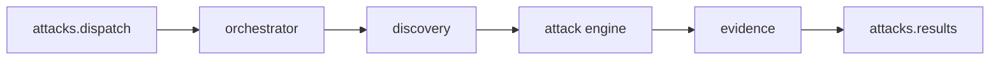

# shingeki-dast-worker

Microsserviço **Go** que consome lotes de ataque do RabbitMQ, descobre superfície no alvo, executa payloads do catálogo, valida evidências e publica achados de volta para a API.

## Pipeline



1. **Consumer** lê mensagem batch da fila de entrada.
2. **Discovery** mapeia rotas/formulários/parâmetros no `target_url`.
3. **Attack** aplica injectors conforme categoria e local do vetor.
4. **Evidence** confirma vulnerabilidade (regex, markers de path traversal, timing; diff de corpo só para categorias sem validador específico).
5. **Publisher** envia uma mensagem por achado na fila de saída.

## Pacotes `internal/`

| Pacote | Papel |
|--------|--------|
| `config` | Variáveis de ambiente (RabbitMQ, flags de discovery) |
| `queue` | Conexão, declare de filas, consumer e publisher |
| `contracts` | Tipos de dispatch, result, completion (JSON alinhado à API) |
| `discovery` | Orquestra BFS + crawlers estático (Colly) e dinâmico (Rod/SPA) |
| `discovery/static` | Colly — HTML estático |
| `discovery/dynamic` | Rod — click/explore em SPA quando `DISCOVERY_ROD_ENABLED=true` |
| `discovery/bfs` | Fila de URLs/fronteira de exploração |
| `attack` | Engine, worker pool, mapeamento vetor → injector |
| `attack/injectors` | SQLi, XSS, path traversal, etc. |
| `evidence` | Motor de validação (regex, markers de path traversal, timing; diff genérico limitado) |
| `evidence/xss` | Rod para diálogo/alerta em XSS |
| `orchestrator` | Liga discovery → attack → evidence → publish |
| `oast` | Cliente opcional para cenários out-of-band |

## Filas RabbitMQ

### Entrada: `attacks.dispatch`

```json
{
  "event": "attack.dispatch.batch",
  "scan_type": "DAST",
  "depth": "full",
  "start_path": "/products",
  "max_routes": 50,
  "system_id": "uuid",
  "user_id": "uuid",
  "target_url": "https://target.example",
  "repository_url": "https://github.com/org/repo",
  "attacks": [
    {
      "attack_id": "uuid",
      "category": "SQL_INJECTION",
      "target_location": "FORM",
      "risk_level": "HIGH",
      "payload": { "field": "email", "value": "' OR 1=1 --" }
    }
  ],
  "dispatched_at": "2026-05-28T12:00:00Z"
}
```

`depth` (`quick` | `full`) ajusta discovery: **quick** usa limites menores e desliga Rod; **full** (padrão) usa `DISCOVERY_MAX_*`.

`start_path` / `max_routes` (opcionais) escopam o crawl: o BFS começa em `target_url` + `start_path` e visita no máximo `max_routes` páginas (`MaxPages`). Com escopo, o limiar de 20 vetores do quick não se aplica.

### Saída: `attacks.results` (uma mensagem por achado)

```json
{
  "attack_id": "uuid",
  "system_id": "uuid",
  "vulnerable_route": "/login",
  "payload_used": "' OR 1=1 --",
  "evidence": "SQL error signature detected in response body",
  "http_request": "POST /login HTTP/1.1\r\n..."
}
```

A API consome essa fila via `attacks:consume-results` (container **`api-consumers`** no setup padrão) e persiste `SystemResult` vinculado ao `AttackDispatch`.

## Discovery

- **Estático**: Colly segue links e formulários em HTML tradicional.
- **Dinâmico** (Rod, quando `DISCOVERY_ROD_ENABLED=true`): após o seed, faz **click/explore** — clica botões/links da UI, observa mudança de URL e XHR same-origin, e monta vetores. Prioriza ações CRUD (criar/editar/…); ignora logout/mailto/javascript e URLs da blocklist (`/cdn-cgi/`, analytics, assets).
- **BFS estático / budgets**: `depth` (`quick`/`full`) ajusta `MaxDepth`/`MaxPages` e desliga Rod no `quick`. `start_path` define a semente; `max_routes` sobrescreve `MaxPages`. Clique limitado por `DISCOVERY_MAX_CLICKS` (default 80); settle pós-clique em `DISCOVERY_EXPLORE_SETTLE` (default `1500ms`).
- Com `start_path` presente, o composite dispara Rod mesmo se o Colly já tiver vetores suficientes (explore focado na feature).

### Variáveis úteis (discovery)

| Env | Default | Papel |
|-----|---------|--------|
| `DISCOVERY_ROD_ENABLED` | `false` | Liga Chromium/Rod |
| `DISCOVERY_MAX_PAGES` | `50` | Páginas/estados no crawl |
| `DISCOVERY_MAX_CLICKS` | `80` | Cliques no explore Rod |
| `DISCOVERY_EXPLORE_SETTLE` | `1500ms` | Espera após navigate/click |
| `DISCOVERY_MIN_VECTORS_FOR_ROD` | `2` | Sem `start_path`, Rod só se Colly achar poucos vetores |

## Execução de ataques

- Pool de workers Resty para requisições paralelas controladas.
- `mapper` traduz `category` + `target_location` do catálogo para o injector correto.
- Payloads vêm do batch; o worker não redefine catálogo — só executa o que a API enfileirou.

## Relação com a API e o alvo

- A API publica o batch após validar o aceite de responsabilidade no dispatch ([ATTACK-ACKNOWLEDGMENT.md](../api/ATTACK-ACKNOWLEDGMENT.md)) e a policy do sistema.
- O worker não autentica no Sanctum; confia no `target_url` e no conteúdo já autorizado pela API no dispatch. Alvo de lab: [shingeki-vulnerable-target](shingeki-vulnerable-target.md).
