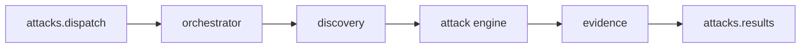

# DAST worker (`workers/dast`)

Microsserviço **Go** que consome lotes de ataque do RabbitMQ, descobre superfície no alvo, executa payloads do catálogo, valida evidências e publica probes e achados de volta para a API.

## Pipeline



1. **Consumer** lê mensagem batch da fila de entrada.
2. **Discovery** mapeia rotas/formulários/parâmetros no `target_url`.
3. **Attack** aplica injectors conforme categoria e local do vetor.
4. **Evidence** confirma vulnerabilidade (regex, markers de path traversal, timing; diff de corpo só para categorias sem validador específico).
5. **Publisher** envia uma mensagem por **probe** (`attack.probe`, outcome `vulnerable` / `clean` / `error`) e uma por **achado** confirmado; ao terminar, publica `attack.dispatch.completed` com `status` `completed` ou `failed`.

## Pacotes `internal/`

| Pacote | Papel |
|--------|--------|
| `config` | Variáveis de ambiente (RabbitMQ, flags de discovery) |
| `queue` | Conexão, declare de filas, consumer e publisher |
| `contracts` | Tipos de dispatch, result, completion (JSON alinhado à API) |
| `discovery` | Orquestra crawler dinâmico (Rod/SPA) com fallback estático (Colly) |
| `discovery/static` | Colly — HTML estático, só se o Chromium falhar ou Rod estiver desligado |
| `discovery/dynamic` | Rod — browser-first: DOM renderizado, cliques, forms e XHR/fetch |
| `discovery/bfs` | Fila de prioridade de URLs (score) e filtros de origem/blocklist |
| `attack` | Engine, worker pool, mapeamento vetor → injector |
| `attack/injectors` | SQLi, XSS, path traversal, etc. |
| `evidence` | Motor de validação (regex, markers de path traversal, timing; diff genérico limitado) |
| `orchestrator` | Liga discovery → attack → evidence → publish |

## Filas RabbitMQ

### Entrada: `attacks.dispatch`

```json
{
  "event": "attack.dispatch.batch",
  "scan_type": "DAST",
  "depth": "full",
  "start_path": "/products",
  "max_routes": 50,
  "system_id": "uuid",
  "user_id": "uuid",
  "target_url": "https://target.example",
  "repository_url": "https://github.com/org/repo",
  "attacks": [
    {
      "attack_id": "uuid",
      "category": "SQL_INJECTION",
      "target_location": "FORM",
      "risk_level": "HIGH",
      "payload": { "field": "email", "value": "' OR 1=1 --" }
    }
  ],
  "dispatched_at": "2026-05-28T12:00:00Z"
}
```

`depth` (`quick` | `full`) ajusta discovery: **quick** usa limites menores e desliga Rod; **full** (padrão) usa `DISCOVERY_MAX_*`.

`start_path` / `max_routes` (opcionais) escopam o crawl: o BFS começa em `target_url` + `start_path` e visita no máximo `max_routes` páginas (`MaxPages`). Com escopo, o limiar de 20 vetores do quick não se aplica.

### Saída: `attacks.results`

A mesma fila carrega três eventos. A API consome via `attacks:consume-results` (container **`api-consumers`**).

**Probe** (`event: attack.probe`) — toda tentativa de payload, persistida em `dispatch_probes`:

```json
{
  "event": "attack.probe",
  "dispatch_id": "uuid",
  "system_id": "uuid",
  "attack_id": "uuid",
  "route": "/login",
  "payload_used": "' OR 1=1 --",
  "http_request": "POST /login HTTP/1.1\r\n...",
  "outcome": "vulnerable",
  "evidence": "SQL error signature detected in response body"
}
```

`outcome`: `vulnerable`, `clean` ou `error` (`error_message` obrigatório quando `error`).

**Achado** — uma mensagem por vulnerabilidade confirmada; persiste `SystemResult`:

```json
{
  "attack_id": "uuid",
  "system_id": "uuid",
  "vulnerable_route": "/login",
  "payload_used": "' OR 1=1 --",
  "evidence": "SQL error signature detected in response body",
  "http_request": "POST /login HTTP/1.1\r\n..."
}
```

Contrato HTTP dos resultados: [ATTACKS-AND-RESULTS.md](../api/ATTACKS-AND-RESULTS.md).

## Discovery

- **Dinâmico (principal)**: Rod/Chromium, quando `DISCOVERY_ROD_ENABLED=true`. Abre o seed, espera o JavaScript (`WaitLoad` + settle), clica botões/`role=button`/`onclick`, preenche formulários com dados fictícios e observa o tráfego de rede. URLs entram numa **fila de prioridade** (score): rotas com `api`/`admin`/`estoque`/CRUD sobem; `blog`/`faq`/paginação descem.
- **Rede**: observação passiva (`NetworkRequestWillBeSent`). POST/PUT/PATCH/DELETE no mesmo registrable domain (REST e GraphQL, inclusive `api.`) viram vetores. Sem hijack de `fetch`. Rotas XHR gravadas pela extensão entram no mapa mesmo se o Chromium headless cair no login.
- **Sessão**: replay estruturado — cookies com domain/path/SameSite/HttpOnly/partition, `Authorization`, `auth.storage` (local/session por origem) e User-Agent da captura. Injeta na origem antes do seed. Redirect para `/login` **não aborta** o crawl: segue rotas gravadas. Se não houver Bearer, sintetiza a partir de chaves no storage (`access_token`, `jwt`, …) para a fase HTTP.
- **Chrome do usuário / proxy**: `DISCOVERY_CDP_URL` anexa a um Chrome já aberto (`--remote-debugging-port=9222`) em vez de lançar Chromium headless. `DISCOVERY_PROXY` (ex. SOCKS no host) faz o crawl sair com o mesmo IP da sessão capturada.
- **Estático (fallback)**: Colly só se o Chromium falhar (ou Rod estiver desligado). Segue `href` e extrai forms do HTML; também visita rotas gravadas.
- **Budgets**: `depth` `quick` reduz `MaxPages`/`MaxClicks`/forms/settle e **desliga Rod**. `start_path` define a semente; `max_routes` sobrescreve `MaxPages` e limita o número de vetores. Clique limitado por `DISCOVERY_MAX_CLICKS`; submits por `DISCOVERY_MAX_FORM_SUBMITS`. Logout, pagamento e login (quando já há sessão) não são submetidos.

### Variáveis úteis (discovery)

| Env | Default | Papel |
|-----|---------|--------|
| `DISCOVERY_ROD_ENABLED` | `false` | Liga Chromium/Rod (principal) |
| `DISCOVERY_MAX_PAGES` | `50` | Páginas/estados no crawl |
| `DISCOVERY_MAX_CLICKS` | `80` | Cliques no explore Rod |
| `DISCOVERY_MAX_FORM_SUBMITS` | `8` | Submits de formulário por job |
| `DISCOVERY_EXPLORE_SETTLE` | `1500ms` | Espera após navigate/click/submit |
| `DISCOVERY_CDP_URL` | vazio | Anexa a um Chrome existente; se a porta estiver fechada, lança o Chromium do container |
| `DISCOVERY_PROXY` | vazio | `proxy-server` do Chromium (SOCKS/HTTP) para o mesmo IP da captura |

## Execução de ataques

- Pool de workers Resty para requisições paralelas controladas.
- `mapper` traduz `category` + `target_location` do catálogo para o injector correto.
- Payloads vêm do batch; o worker não redefine catálogo — só executa o que a API enfileirou.

## Relação com a API e o alvo

- A API publica o batch após validar o aceite de responsabilidade no dispatch ([ATTACK-ACKNOWLEDGMENT.md](../api/ATTACK-ACKNOWLEDGMENT.md)) e a policy do sistema.
- O worker não autentica no Sanctum; confia no `target_url` e no conteúdo já autorizado pela API no dispatch. Alvo de lab: [vulnerable-target](shingeki-vulnerable-target.md). Treino: [Juice Shop](shingeki-juice-shop.md).
