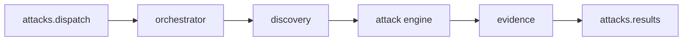

# shingeki-dast-worker

Microsserviço **Go** que consome lotes de ataque do RabbitMQ, descobre superfície no alvo, executa payloads do catálogo, valida evidências e publica achados de volta para a API.

## Pipeline



1. **Consumer** lê mensagem batch da fila de entrada.
2. **Discovery** mapeia rotas/formulários/parâmetros no `target_url`.
3. **Attack** aplica injectors conforme categoria e local do vetor.
4. **Evidence** confirma vulnerabilidade (regex, diff, timing, diálogo XSS com Rod quando habilitado).
5. **Publisher** envia uma mensagem por achado na fila de saída.

## Pacotes `internal/`

| Pacote | Papel |
|--------|--------|
| `config` | Variáveis de ambiente (RabbitMQ, flags de discovery) |
| `queue` | Conexão, declare de filas, consumer e publisher |
| `contracts` | Tipos de dispatch, result, completion (JSON alinhado à API) |
| `discovery` | Orquestra BFS + crawlers estático (Colly) e dinâmico (Rod/SPA) |
| `discovery/static` | Colly — HTML estático |
| `discovery/dynamic` | Rod — SPAs quando `DISCOVERY_ROD_ENABLED=true` |
| `discovery/bfs` | Fila de URLs/fronteira de exploração |
| `attack` | Engine, worker pool, mapeamento vetor → injector |
| `attack/injectors` | SQLi, XSS, path traversal, etc. |
| `evidence` | Motor de validação (regex, diff de corpo, timing) |
| `evidence/xss` | Rod para diálogo/alerta em XSS |
| `orchestrator` | Liga discovery → attack → evidence → publish |
| `oast` | Cliente opcional para cenários out-of-band |

## Filas RabbitMQ

### Entrada: `attacks.dispatch`

```json
{
  "event": "attack.dispatch.batch",
  "system_id": "uuid",
  "user_id": "uuid",
  "target_url": "https://target.example",
  "repository_url": "https://github.com/org/repo",
  "attacks": [
    {
      "attack_id": "uuid",
      "category": "SQL_INJECTION",
      "target_location": "FORM",
      "risk_level": "HIGH",
      "payload": { "field": "email", "value": "' OR 1=1 --" }
    }
  ],
  "dispatched_at": "2026-05-28T12:00:00Z"
}
```

### Saída: `attacks.results` (uma mensagem por achado)

```json
{
  "attack_id": "uuid",
  "system_id": "uuid",
  "vulnerable_route": "/login",
  "payload_used": "' OR 1=1 --",
  "evidence": "SQL error signature detected in response body",
  "http_request": "POST /login HTTP/1.1\r\n..."
}
```

A API consome essa fila via `php artisan attacks:consume-results` e persiste `SystemResult` vinculado ao `AttackDispatch`.

## Discovery

- **Estático**: Colly segue links e formulários em HTML tradicional.
- **Dinâmico** (opcional): headless Chromium (Rod) para rotas renderizadas no cliente.
- **BFS**: limita profundidade e evita explosão de URLs no lab.

## Execução de ataques

- Pool de workers Resty para requisições paralelas controladas.
- `mapper` traduz `category` + `target_location` do catálogo para o injector correto.
- Payloads vêm do batch; o worker não redefine catálogo — só executa o que a API enfileirou.

## Relação com a API e o alvo

- A API publica o batch após validar assinatura no HTML do alvo ([shingeki-vulnerable-target](shingeki-vulnerable-target.md)).
- O worker não autentica no Sanctum; confia no `target_url` e no conteúdo já validado pela API no dispatch.
