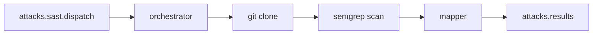

# shingeki-sast-worker

Microsserviço **Go** que consome lotes SAST do RabbitMQ, clona o repositório do sistema, executa **Semgrep** (PHP, TypeScript e JavaScript) e publica achados na mesma fila de resultados usada pelo DAST.

## Pipeline

1. **Consumer** lê mensagem batch da fila `attacks.sast.dispatch` (`scan_type: SAST`).
2. **Clone** faz `git clone --depth 1` de `repository_url` em diretório temporário.
3. **Semgrep** roda com regras `p/php`, `p/typescript` e `p/javascript`.
4. **Mapper** converte cada finding em `ResultMessage` (mesmo contrato da API).
5. **Publisher** envia achados e mensagem de conclusão em `attacks.results`.

## Pacotes `internal/`

| Pacote | Papel |
|--------|--------|
| `config` | RabbitMQ, timeouts, linguagens Semgrep |
| `queue` | Conexão, declare de filas, consumer e publisher |
| `contracts` | Tipos de dispatch, result, completion (JSON alinhado à API) |
| `repository` | Clone do repositório Git |
| `scanner` | Execução do Semgrep e parse do JSON |
| `mapper` | Finding Semgrep → `ResultMessage` |
| `orchestrator` | Liga clone → scan → publish |

## Filas RabbitMQ

| Fila | Direção | Conteúdo |
|------|---------|----------|
| `attacks.sast.dispatch` | API → worker | Batch SAST (`scan_type: SAST`, `repository_url` obrigatório) |
| `attacks.results` | worker → API | Achados e `attack.dispatch.completed` (compartilhada com DAST) |

O comando `attacks:consume-results` (no container **`api-consumers`**) processa resultados de **ambos** os workers.

## Mapeamento de achados SAST

| Campo API | Origem Semgrep |
|-----------|----------------|
| `vulnerable_route` | `path:line` |
| `payload_used` | `check_id` da regra |
| `evidence` | mensagem + trecho de código |
| `http_request` | contexto sintético (`file: ...`) |

## Variáveis de ambiente

Ver [`shingeki-sast-worker/.env.example`](https://github.com/AllanCordova/shingeki/blob/main/shingeki-sast-worker/.env.example).

| Variável | Default | Descrição |
|----------|---------|-----------|
| `RABBITMQ_ATTACKS_DISPATCH_QUEUE` | `attacks.sast.dispatch` | Fila de entrada |
| `RABBITMQ_ATTACKS_RESULTS_QUEUE` | `attacks.results` | Fila de saída |
| `SEMGREP_BINARY` | `semgrep` | Binário do Semgrep |
| `SAST_CLONE_TIMEOUT` | `10m` | Timeout do `git clone` |
| `SAST_SCAN_TIMEOUT` | `20m` | Timeout do scan |
| `SAST_LANGUAGES` | `php,typescript,javascript` | Linguagens analisadas |
| `GITHUB_TOKEN` | — | Clone de repositórios privados no GitHub |
| `SAST_LAB_REPOSITORY_PATH` | — | Fallback dev-only quando `repository_url` está vazio |

## Limitações (MVP)

- Um item de catálogo SAST cobre todos os findings (`attack_id` do primeiro ataque do batch).
- Campo `http_request` reutilizado como contexto de código (nome legado do contrato DAST).

## Docker

Serviço `sast-worker` no [`docker-compose.yml`](https://github.com/AllanCordova/shingeki/blob/main/docker-compose.yml): imagem com Go + Git + Semgrep (pip), sem Chromium.
