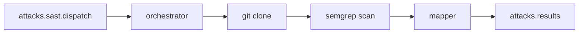

# SAST worker (`workers/sast`)

Microsserviço **Go** que consome lotes SAST do RabbitMQ, clona o repositório do sistema, executa **Semgrep** (PHP, TypeScript, JavaScript, Python, Go, Java e Ruby) e publica achados na mesma fila de resultados usada pelo DAST.

## Pipeline

1. **Consumer** lê mensagem batch da fila `attacks.sast.dispatch` (`scan_type: SAST`).
2. **Clone** faz `git clone --depth 1` de `repository_url` em diretório temporário.
3. **Semgrep** roda `p/default` + `p/owasp-top-ten` e os packs das linguagens **presentes no repo** (`p/php`, `p/typescript`, `p/javascript`, `p/python`, `p/golang`, `p/java`, `p/ruby`). `go` no catálogo vira `p/golang` — `p/go` 404 e derruba o scan inteiro.
4. **Mapper** associa cada `check_id` a um ataque SAST do catálogo (SQLi, XSS, path traversal…). Findings sem categoria no lote são descartados.
5. **Publisher** envia achados, probes `clean` para categorias sem hit, e mensagem de conclusão em `attacks.results`.

## Pacotes `internal/`

| Pacote | Papel |
|--------|--------|
| `config` | RabbitMQ, timeouts, linguagens Semgrep |
| `queue` | Conexão, declare de filas, consumer e publisher |
| `contracts` | Tipos de dispatch, result, completion (JSON alinhado à API) |
| `repository` | Clone do repositório Git |
| `scanner` | Execução do Semgrep e parse do JSON |
| `mapper` | Finding Semgrep → `ResultMessage` |
| `orchestrator` | Liga clone → scan → publish |

## Filas RabbitMQ

| Fila | Direção | Conteúdo |
|------|---------|----------|
| `attacks.sast.dispatch` | API → worker | Batch SAST (`scan_type: SAST`, `repository_url` obrigatório) |
| `attacks.results` | worker → API | Achados, probes `clean` e `attack.dispatch.completed` (compartilhada com DAST) |

O comando `attacks:consume-results` (no container **`api-consumers`**) processa resultados de **ambos** os workers. O SAST publica probes `clean` por categoria do catálogo sem hit — cobertura, não HTTP.

## Mapeamento de achados SAST

| Campo API | Origem Semgrep |
|-----------|----------------|
| `attack_id` | Ataque SAST do lote cuja categoria bate com o `check_id` |
| `vulnerable_route` | `path:line` |
| `payload_used` | `check_id` da regra (casa com `semgrep_rule_id` na remediação) |
| `evidence` | mensagem + trecho de código |
| `http_request` | contexto sintético (`file: ...`) |

## Limitações

- Campo `http_request` reutilizado como contexto de código (nome legado do contrato DAST).
- Packs Semgrep extras entram só se a linguagem estiver no allowlist do worker.

## Variáveis de ambiente

Ver [`workers/sast/.env.example`](https://github.com/AllanCordova/shingeki/blob/main/workers/sast/.env.example).

| Variável | Default | Descrição |
|----------|---------|-----------|
| `RABBITMQ_ATTACKS_DISPATCH_QUEUE` | `attacks.sast.dispatch` | Fila de entrada |
| `RABBITMQ_ATTACKS_RESULTS_QUEUE` | `attacks.results` | Fila de saída |
| `SEMGREP_BINARY` | `semgrep` | Binário do Semgrep |
| `SAST_CLONE_TIMEOUT` | `10m` | Timeout do `git clone` |
| `SAST_SCAN_TIMEOUT` | `20m` | Timeout do scan |
| `SAST_LANGUAGES` | `php,typescript,javascript,python,go,java,ruby` | Linguagens analisadas quando o lote não traz `payload.languages` |
| `GITHUB_TOKEN` | — | Clone de repositórios privados no GitHub |
| `SAST_LAB_REPOSITORY_PATH` | — | Fallback dev-only quando `repository_url` está vazio |

## Docker

Serviço `sast-worker` no [`docker-compose.yml`](https://github.com/AllanCordova/shingeki/blob/main/docker-compose.yml), profile `stack`: imagem com Go + Git + Semgrep (pip), sem Chromium. Como subir: [RUN-PROJECT.md](../RUN-PROJECT.md).
