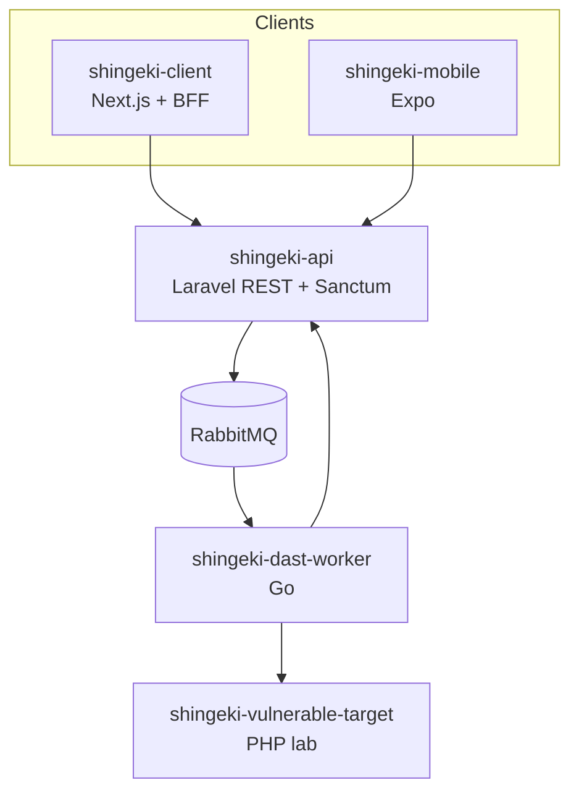

# Documentação Shingeki

Bem-vindo à documentação do **Shingeki** — plataforma para detecção automatizada e remediação interativa de vulnerabilidades web.

## Arquitetura

| Pacote | Papel |
|--------|--------|
| `shingeki-api` | Projetos, sistemas, assinaturas, disparo DAST, resultados |
| `shingeki-client` | Interface web (BFF em `/api`) |
| `shingeki-mobile` | App Android/iOS (chamada direta à API) |
| `shingeki-dast-worker` | Varredura e publicação de achados |
| `shingeki-vulnerable-target` | Alvo de laboratório para testes |

## Por onde começar

1. **[Como rodar o projeto](RUN-PROJECT.md)** — clone, API, Docker, credenciais do seed.
2. **[Desenvolvimento web](WEB-DEVELOPMENT.md)** ou **[mobile](MOBILE-DEVELOPMENT.md)** — client escolhido.
3. **[API REST](API.md)** — rotas, erros e guias por módulo.
4. **[CI](CI.md)** — lint e testes antes de abrir PR.

Repositório: [github.com/AllanCordova/shingeki](https://github.com/AllanCordova/shingeki).
